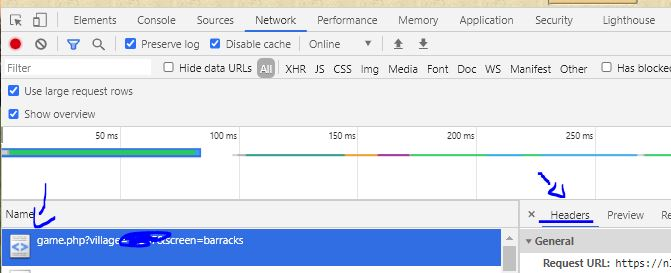

# Tribal Wars Bot (TWB)
## An open source bot for the Tribal Wars game

*Features:*
- Cooperative mode (you can keep playing using the browser while the bot manages stuff in the background)
- Building management
- Defence management
- Troop management
- Flag management
- Automatically adds conquered villages
- Farm management
- Market management
- Premium market (free premium points :D)
- Research management (including level systems)
- Automatic snob creation
- Report management
- ReCaptcha "bypass" by using browser cookie string (bot works if browser session is valid)

*How To:*
- Install Python 3.x
- Install the requirements (pip install -r requirements.txt)
- Either copy config.example.json to config.json and edit the following things:
	- add at least the endpoint and server
	- change the village_template configuration section to your needs
- Or just run `python twb.py` and enter the requested information

- Start the bot by running python twb.py and supply the cookie string from your browser
- If login works you can adjust the config.json to your needs, it will automatically reload on change.
- Your villages will be added to the config automatically, disable the "managed" parameter to make the bot skip the village
- Additional properties can be tweaked by running the manager.py script
- You might want to set the bot user-agent in core/request.py to your own user agent. They probably wont notice but just in case :)

You can find the cookie string in the following location (Chrome):

You need to use the cookie: header value

*optional: If everything is set-up correctly and the bot is running you can `cd` into the webmanager directory and start the bot interface by running `server.py`. You can access this dashboard by visiting http://127.0.0.1:5000/ in your browser.
A lot of new features will be added to the dashboard soon.*

More information about configuring the bot can be found in the readme directory!

